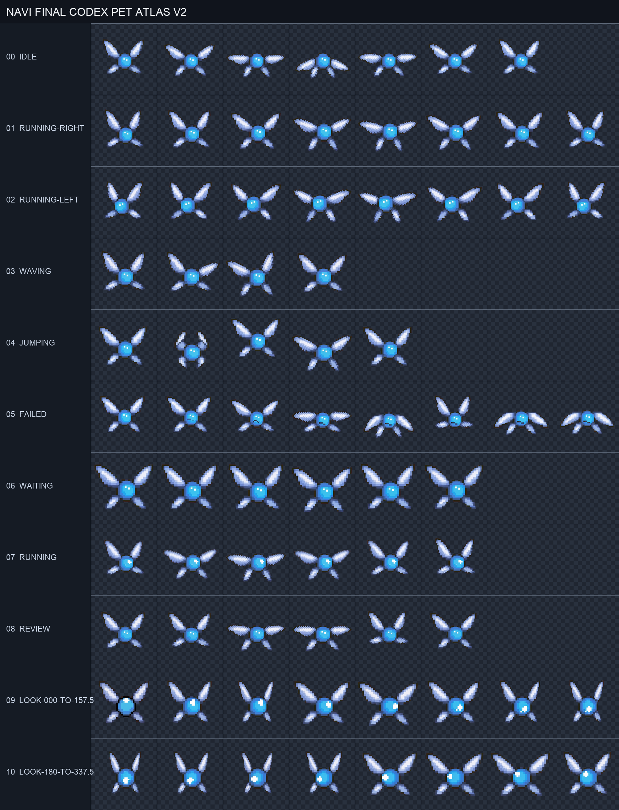

# Codex Pet Kit

An unofficial macOS installer for custom Codex pets and completion sounds.
The bundled Navi-inspired pet includes ten animated states and directional
pointer tracking.



## What it installs

- A Codex custom pet under `~/.codex/pets/navi/`.
- An optional completion sound supplied by you.
- An optional Claude Code `Stop` hook for local sessions.
- A notification hook that does not log prompt or response content.
- Timestamped backups and a recoverable uninstall.

No game audio is included or downloaded.

## Requirements

- macOS.
- Codex Desktop with custom-pet support.
- An audio file readable by macOS, if you want completion audio.
- Claude Code is optional. Ordinary Claude Chat and Cowork are not supported.

## Quick start

```zsh
git clone https://github.com/hey-im-taylor/codex-pet-kit.git
cd codex-pet-kit
./install --sound "/path/to/your/alert.wav" --claude-code
```

To install only the pet:

```zsh
./install
```

Then fully restart Codex and open **Settings → Pets → Refresh**. Select Navi.

The installer will not replace an existing Codex `notify` command. It installs
the pet and sound, preserves the existing command, and points to the manual
chaining instructions in [Troubleshooting](docs/troubleshooting.md).

## Test

Validate the pet and scripts:

```zsh
./test
```

Play the installed completion sound:

```zsh
./test --audio
```

Review all animations in [the visual preview](preview/README.md). A standalone
local preview is also available at `preview/index.html`.

## Uninstall

```zsh
./uninstall
```

Uninstall moves installed files into a timestamped recovery folder instead of
permanently deleting them. It removes only the configuration block and Claude
Code hook created by this project.

## Support

| Surface | Support |
| --- | --- |
| Codex Desktop on macOS | Pet and completion sound |
| Codex CLI on macOS | Completion sound |
| Claude Code CLI on macOS | Optional completion sound |
| Claude Desktop, Local Code | Optional completion sound |
| Ordinary Claude Chat | Not supported |
| Claude Cowork, Cloud, or SSH | Not supported |
| Windows and Linux | Not supported in this release |

Codex's custom-pet format is not a stable public API. A future Codex update may
require a new spritesheet layout or installer change.

## Copyright

This is an unofficial fan project and is not affiliated with or endorsed by
Nintendo, OpenAI, or Anthropic. No Nintendo audio is included. Users must supply
audio they own or have permission to use. See [NOTICE.md](NOTICE.md) and the
[Navi asset notice](packs/navi/ASSET-NOTICE.md).

The scripts and documentation are licensed under the MIT License.
