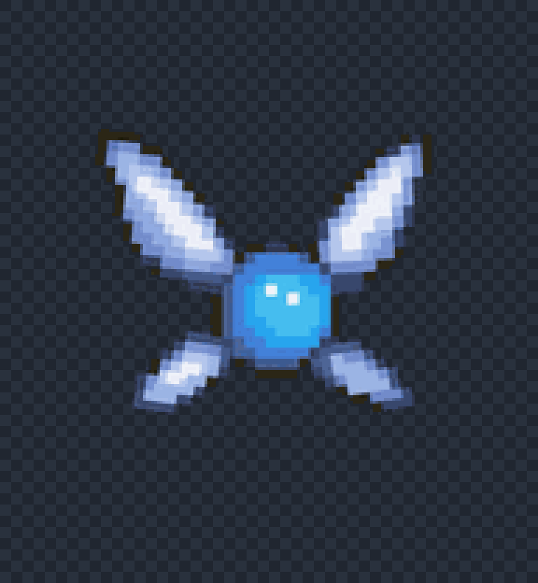
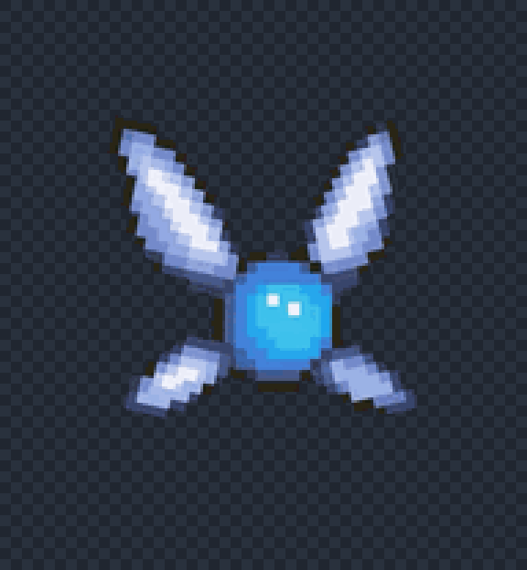
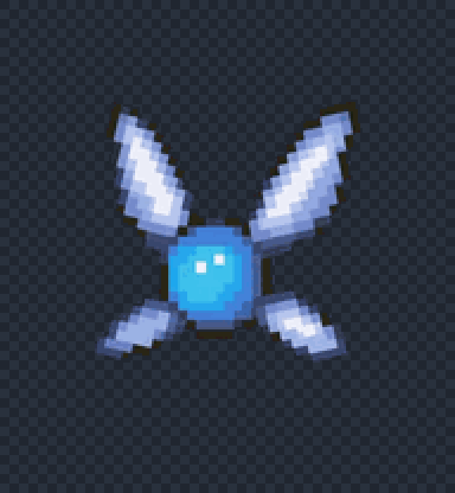
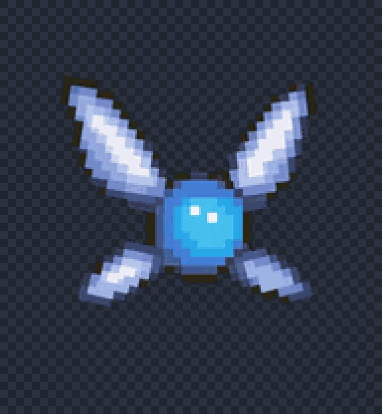
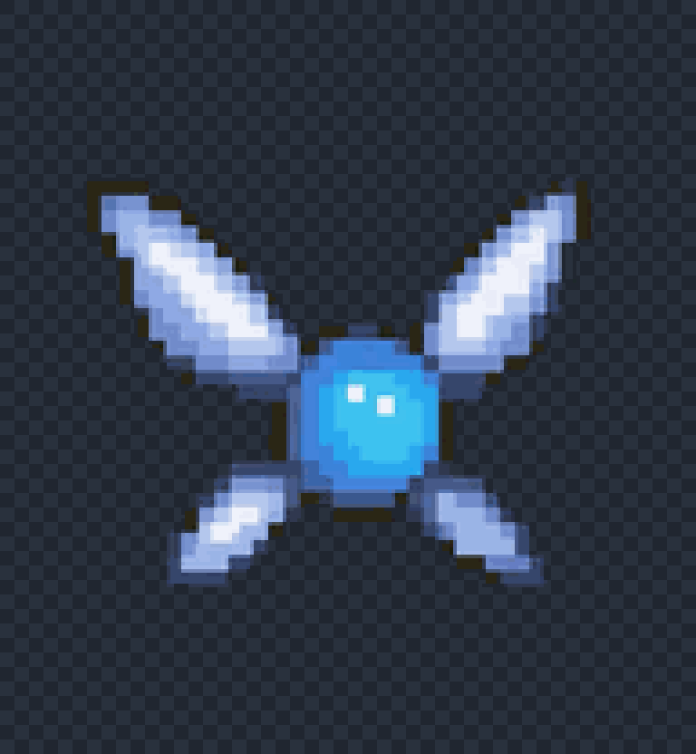
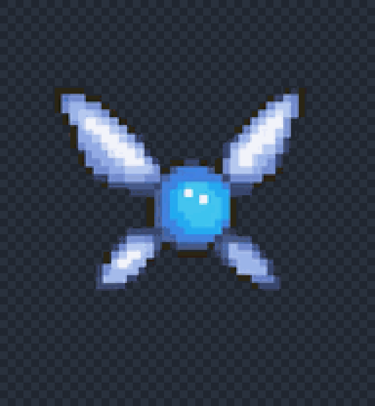
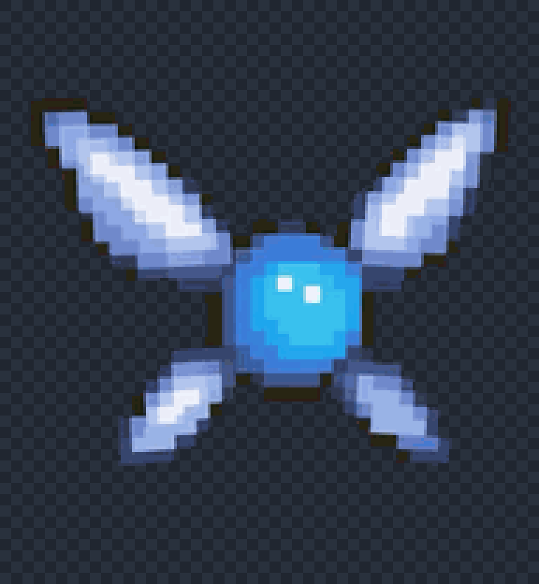
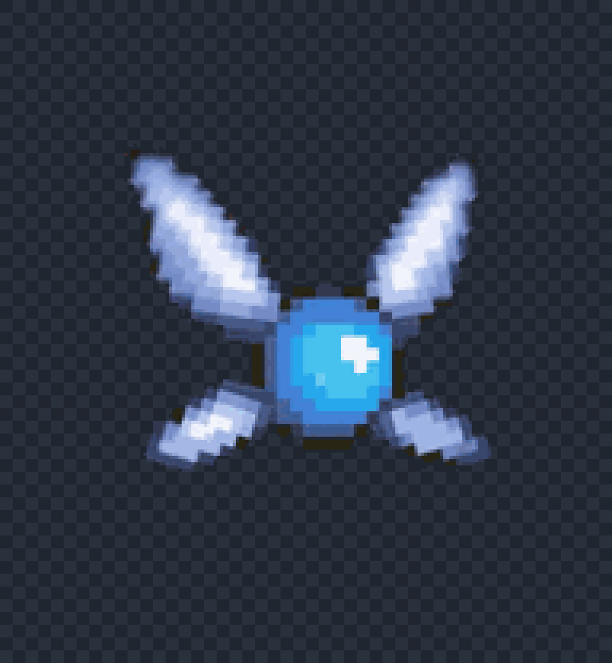
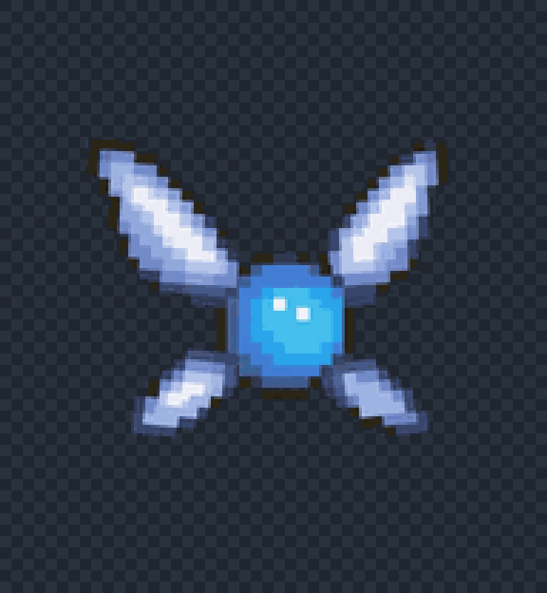
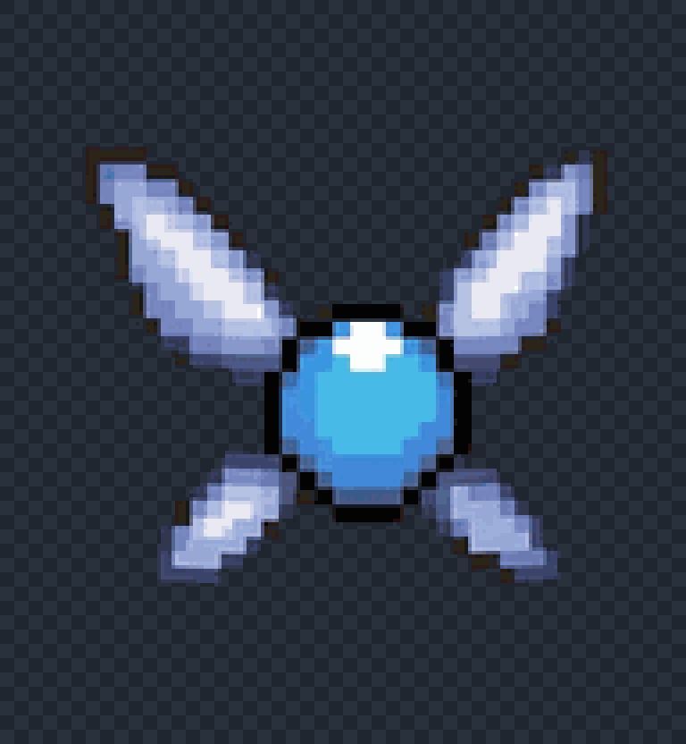

# Navi animation preview

| State | Preview |
| --- | --- |
| Idle |  |
| Fly right |  |
| Fly left |  |
| Wave |  |
| Jump |  |
| Failed |  |
| Waiting |  |
| Working |  |
| Review |  |
| Look directions |  |

The look-direction preview cycles all 16 directional poses. In Codex, the
pointer position selects the corresponding pose instead of playing them as one
continuous animation.
